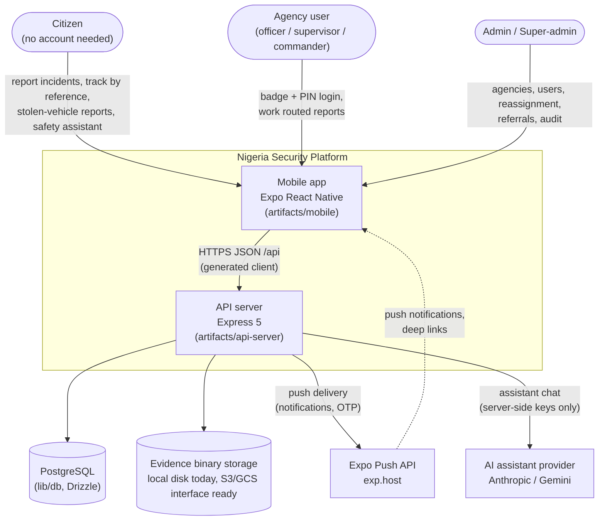
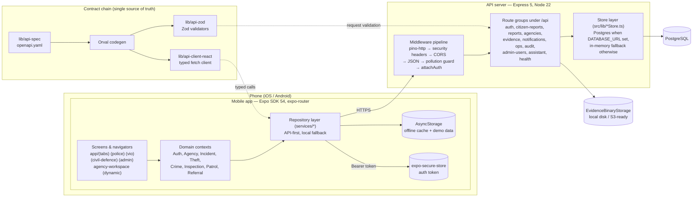
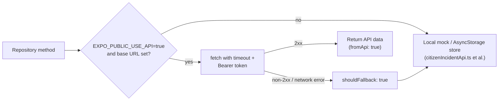
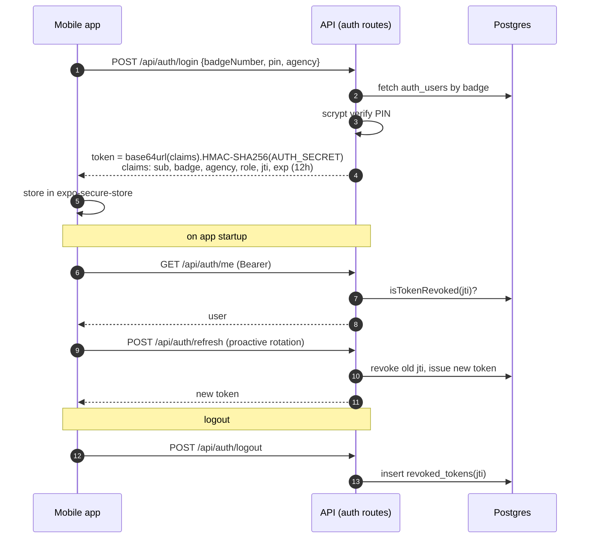
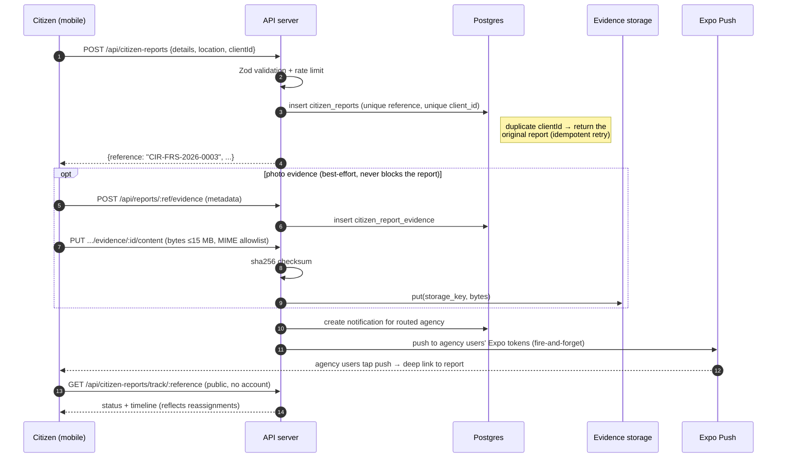
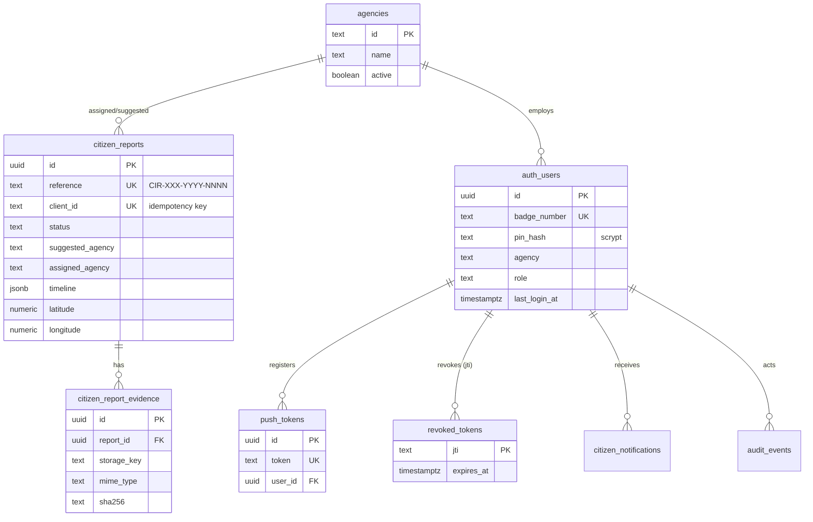
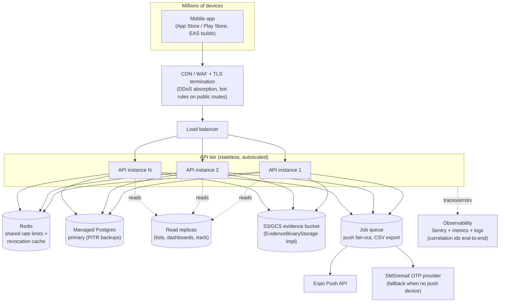

# Nigeria Security App — System Architecture

> Audience: engineers and reviewers who need to understand how the system is built,
> where the trust boundaries are, and what must change before it serves millions of
> users. Companion documents: [ROADMAP.md](ROADMAP.md) (the working-backwards plan to
> production) and [TOOLING.md](TOOLING.md) (developer and operations tooling).
>
> Diagrams are Mermaid — they render on GitHub and in VS Code (with the Mermaid
> extension or built-in Markdown preview).

## 1. System context

The platform connects three kinds of people — citizens, agency personnel (FRSC, Police,
VIO, NSCDC, plus admin-created agencies), and platform administrators — through one
mobile app and one API.

Key property: **citizens are anonymous**. Public endpoints (report submission, tracking
by reference, evidence attach) require no account — which makes them the primary abuse
surface and the reason rate limiting, validation, and idempotency live there.

## 2. Container view

### The contract chain

`lib/api-spec/openapi.yaml` is the single source of truth. `pnpm --filter
@workspace/api-spec codegen` runs Orval ([lib/api-spec/orval.config.ts](../lib/api-spec/orval.config.ts))
and generates both sides of the wire:

- **lib/api-zod** — runtime Zod validators the server uses on every request body.
- **lib/api-client-react** — the typed client the mobile app calls, with a hand-written
  mutator ([custom-fetch.ts](../lib/api-client-react/src/custom-fetch.ts)) that attaches
  the bearer token and normalizes errors.

Server and client therefore cannot drift from each other without the spec changing —
and CI should enforce that codegen output is never stale (see TOOLING.md §6).

## 3. Mobile app architecture

### Data layer: API-first with local fallback

Every repository in [artifacts/mobile/services/](../artifacts/mobile/services/) follows
one pattern, implemented by `mobileApiFetch` in
[apiClient.ts](../artifacts/mobile/services/apiClient.ts):

Callers never throw on API failure — the app degrades to its offline cache instead of
breaking in the field. Repositories: report, auth, user, agency, notification, audit,
referral, duty, evidence, assistant (all in `services/`).

### Navigation and role routing

expo-router file-based navigation. [app/index.tsx](../artifacts/mobile/app/index.tsx) is
the public landing; on login, `routeForUser` in
[AuthContext.tsx](../artifacts/mobile/context/AuthContext.tsx) routes by agency/role:

| User | Workspace |
| --- | --- |
| FRSC | `app/(tabs)` — home, cases, map, alerts, profile |
| Police | `app/(police)` — crime reports, vehicle check, stolen alerts |
| VIO | `app/(vio)` — inspections, certificates |
| NSCDC | `app/(civil-defence)` — incidents, alerts |
| Admin / super-admin | `app/(admin)` — agencies, users, referrals, audit (hidden tabs) |
| Any admin-created agency (DSS, Fire, custom) | `app/agency-workspace.tsx` — generic scalable workspace |

Every group `_layout.tsx` re-checks `user.agency`/role and redirects to `/` or
`/unauthorized` — client-side defense in depth on top of server RBAC.

### Offline sync and idempotency

Officer incidents queue in [IncidentContext.tsx](../artifacts/mobile/context/IncidentContext.tsx)
with `pendingSync: true` when offline (connectivity polled via expo-network every 15s).
`syncPending()` retries each queued incident up to 2 attempts. Duplicates are impossible
server-side because every submission carries a **stable `clientId`** (the incident's own
id), and `citizen_reports.client_id` has a unique index — a retry after a lost response
returns the original report and reference instead of creating a second row.

### Token handling

Tokens live in **expo-secure-store** (keychain/keystore) via
[authToken.ts](../artifacts/mobile/services/authToken.ts), with AsyncStorage fallback
only where SecureStore is unavailable (web). On startup the app validates the session
(`GET /auth/me`) and proactively rotates the token (`POST /auth/refresh`); it clears the
token only on explicit 401/403, never on network errors.

## 4. API server architecture

### Middleware pipeline (order matters)

Defined in [app.ts](../artifacts/api-server/src/app.ts):

1. **pino-http** — structured logs; honors inbound `X-Request-Id` (≤128 chars) or
   generates a UUID; echoes it on the response for cross-system tracing.
2. **securityHeaders** — `X-Content-Type-Options`, `X-Frame-Options: DENY`, strict CSP
   (`default-src 'none'`), Referrer-Policy, CORP; HSTS in production.
3. **CORS** (currently open — see §8).
4. **Body parsing** + **prototype-pollution guard** (recursive rejection of
   `__proto__`/`constructor`/`prototype` keys → 400).
5. **attachAuth** — parses/verifies the bearer token, checks revocation; non-blocking so
   public routes work, and route guards (`requireAuth` / `requireAdmin` /
   `requireAgencyAccess`) enforce access per route.
6. Routers under `/api`, then a consistent `{error, code}` JSON error surface.

Rate limiting is per-route (fixed window, in-process): login/PIN-reset 20 per 15 min,
OTP 5 per 15 min per IP+badge, citizen submissions and evidence uploads capped.
**In-process means per-instance** — see §9 for the multi-instance implication.

### Authentication and authorization

- Tokens are stateless HMAC (no session store); revocation is DB-backed by `jti` in the
  `revoked_tokens` table (in-memory Map without a database).
- `AUTH_SECRET` signs both auth tokens **and** evidence download URLs; production
  refuses to start without it (≥16 chars).
- RBAC roles: `citizen | officer | supervisor | commander | admin | super_admin`.
  Guards: `requireAuth` (401), `requireAdmin` (403), `requireAgencyAccess` (admin
  bypass, else agency match). The mobile capability matrix
  ([lib/permissions.ts](../artifacts/mobile/lib/permissions.ts)) is a UI hint only —
  the server always re-enforces.
- Self-service PIN reset: OTP (6-digit, sha256-hashed, 10-min TTL, 5 attempts) is
  delivered by **push to the user's own registered devices** — never to a
  caller-supplied address — then a one-shot reset grant allows the PIN change.

### The citizen report path (the core flow)

### Evidence downloads (signed URLs)

Agency users never get raw file paths. They request
`GET /api/reports/:id/evidence/:eid/download-url` (agency-scoped, audited), which mints
a 15-minute HMAC-signed URL: `/api/evidence-files/:eid?exp=…&sig=…`. The download route
verifies expiry and signature in constant time and streams the binary — browser-openable
without a bearer token, but only with a valid signature. The binary backend is behind
the `EvidenceBinaryStorage` interface
([evidenceStorage.ts](../artifacts/api-server/src/lib/evidenceStorage.ts)): local disk
today (with path-traversal guards), S3/GCS is a drop-in implementation.

## 5. Data model

Two schema families coexist in [lib/db/src/schema](../lib/db/src/schema/index.ts):

**Flat mobile-mirror family** — what the live mobile flows use. Plain-text agency ids so
admin-created agencies (DSS, Fire Service, custom) need no tenant provisioning:

**Tenant-scoped family** (`tenants`, `agency_units`, `users`, `case_types`, `cases`,
`evidence`, `referrals`, `duty_sessions`, `citizen_profiles`, `audit_logs`) — a richer
UUID-FK model with per-tenant units and case types, used by the ops routes
(duty sessions, referrals, case types). The long-term direction is to converge the flat
family into this one; until then, both are maintained by the same forward-only
migrations in `lib/db/migrations` (rollback = restore from backup).

Persistence mode is explicit: `DATABASE_URL` set → Postgres; unset → in-memory stores
(dev/demo only, resets on restart). `GET /api/healthz` reports which mode is live and
returns 503 if the database is unreachable.

## 6. Push notifications

Server side ([pushSender.ts](../artifacts/api-server/src/lib/pushSender.ts),
[pushDispatch.ts](../artifacts/api-server/src/lib/pushDispatch.ts)): every in-app
notification is mirrored to Expo push (batched 100 per request, invalid tokens
filtered, rejected receipts logged), targeted per-user or per-agency. OTP delivery
rides the same path. Client side: tokens are registered on real devices only (Expo Go
SDK 53+ cannot receive remote pushes), stored via `POST /api/push-tokens`, and
notification taps deep-link to the route in the push payload — including cold starts.

## 7. Offline & degraded-mode matrix

| Condition | Behavior |
| --- | --- |
| Phone offline | Reports queue locally (`pendingSync`), SyncBanner shows count, sync retries with stable `clientId` → no duplicates |
| API unreachable | Every repository falls back to AsyncStorage cache; app remains fully usable with local data (badged DEMO where applicable) |
| API up, no `DATABASE_URL` | Server runs on in-memory stores; healthz says `"db": "in-memory"`; ops routes return 503 |
| Database down | healthz 503 `db: "error"`; mobile falls back locally |
| Expo Go (no push) | Registration returns `requiresDevelopmentBuild: true`; in-app notification centre still works |
| No native maps (web/fallback) | `CitizenReportMap.tsx` renders the tappable list fallback; `.native.tsx` renders react-native-maps |

## 8. Security architecture and known gaps

Defense layers in place: schema validation on every body (Zod from the OpenAPI
contract), scrypt PIN hashing, HMAC tokens with rotation + DB-backed revocation,
per-route rate limits, prototype-pollution rejection, strict security headers, MIME +
size validation with server-side checksums on uploads, path-traversal guards, signed
expiring download URLs, audit events on sensitive actions, OTP delivery only to the
account's own devices, supply-chain cooldown on npm installs.

**Gaps that must close before production** (each is a roadmap item):

1. **Legacy `mvp.ts` router** ([src/routes/mvp.ts](../artifacts/api-server/src/routes/mvp.ts))
   is still mounted under `/api` and authenticates with client-supplied
   `x-agency`/`x-user-id`/`x-user-role` headers — any caller can claim any role. It
   bypasses the entire HMAC token model. **Remove it or gate it behind
   `NODE_ENV !== "production"`.** This is the single highest-priority fix.
2. **CORS is wide open** (`cors()` with no origin allowlist). Fine for a native app,
   but combined with token-less public routes it invites cross-origin abuse of the
   API from any website.
3. **Assistant endpoint is public and unlimited** (`POST /api/assistant/chat`, no auth,
   no rate limit) — it proxies to paid AI providers, so it is a direct
   cost-amplification target.
4. **Mobile auth is locally authoritative**: the app's seeded user list (PIN `1234`)
   can log a user into the UI even when the API rejects them; the API session is
   established best-effort. Production must flip this — server verdict is the login
   verdict, demo seeding disabled outside demo builds.
5. **Rate limits and token revocation are per-process** — a second API instance would
   not see the first one's counters or revocations. Redis is required before
   horizontal scaling (see §9).
6. **Single `AUTH_SECRET`** signs both tokens and evidence URLs with no rotation
   story. Move to a secret manager with dual-secret (old+new) verification windows.
7. **Anonymous evidence attach**: evidence create/upload on a report is public
   (rate-limited, validated) so citizens can attach photos — acceptable, but the
   upload should also be bound to knowledge of the report's `clientId` or a
   submission token so third parties can't attach files to someone else's report.

## 9. Production topology — the target

This is the end state the [ROADMAP.md](ROADMAP.md) works backwards from: the same two
containers, deployed for millions of users.

Why this shape works for this codebase specifically:

- **The API tier is already stateless** — HMAC tokens need no session store, so
  horizontal scaling is only blocked by the two per-process caches (rate limits,
  revocation), both of which move to Redis behind their existing interfaces.
- **Evidence storage is already an interface** — `EvidenceBinaryStorage` gets an S3
  implementation; signed-URL semantics stay identical (or delegate to S3 presigned
  URLs).
- **The hot public reads** (`track/:reference`, agency lists, dashboards) are
  read-mostly and shard naturally onto replicas.
- **Push fan-out is already fire-and-forget** — moving it from in-process to a queue
  changes the call site, not the semantics.
- **The contract chain means clients don't break** — old app versions keep working as
  long as `openapi.yaml` evolves additively; enforce that in CI with a spec-diff check.

## 10. File map (where to look)

| Concern | Files |
| --- | --- |
| Server entry & middleware | `artifacts/api-server/src/{app.ts, index.ts}`, `src/middlewares/` |
| Auth & tokens | `artifacts/api-server/src/lib/{auth.ts, otpStore.ts, password.ts}`, `src/routes/auth.ts` |
| Reports & lifecycle | `src/routes/{citizen-reports.ts, reports.ts}`, `src/lib/citizenReportStore.ts` |
| Evidence | `src/lib/evidenceStorage.ts`, `src/routes/evidence.ts` |
| Push | `src/lib/{pushSender.ts, pushDispatch.ts}` |
| DB schema & migrations | `lib/db/src/schema/index.ts`, `lib/db/migrations/` |
| API contract & codegen | `lib/api-spec/{openapi.yaml, orval.config.ts}`, `lib/api-zod/`, `lib/api-client-react/` |
| Mobile data layer | `artifacts/mobile/services/` (apiClient, apiConfig, *Repository) |
| Mobile auth & RBAC | `artifacts/mobile/context/AuthContext.tsx`, `artifacts/mobile/lib/permissions.ts` |
| Offline sync | `artifacts/mobile/context/IncidentContext.tsx`, `components/SyncBanner.tsx` |
| Navigation | `artifacts/mobile/app/` (route groups per agency) |
| Tests | `artifacts/api-server/tests/`, `artifacts/mobile/tests/` |
